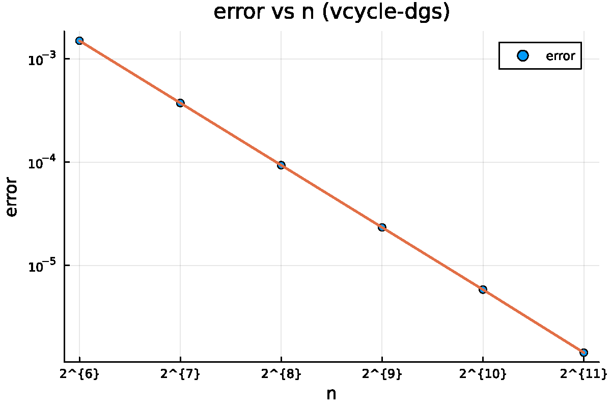
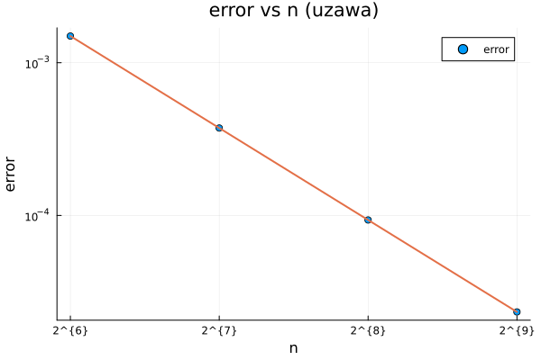
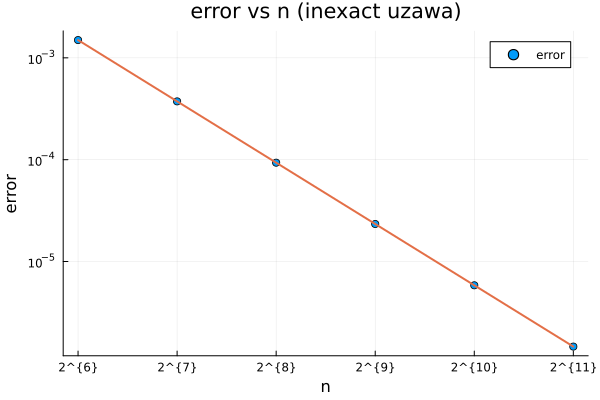

# Solving Stokes Equation using Multigrid and Uzawa Method

# Problem Description
The Stokes equation is a system of elliptic partial differential equations that describe the motion of a viscous fluid. It is a linear simplification of the nonlinear Navier-Stokes equations, and is used to model the flow of fluids of very low Reynolds number.

The 2d Stokes equation is given by
$$-\Delta \vec{u} + \nabla p  = \vec{F},  (x, y) \in (0,1) \times (0,1),$$

$$\text{div} \  \vec{u}  = 0,  (x, y) \in (0,1) \times (0,1).$$

$$\frac{\partial u}{\partial \vec{n}} = b, \quad y = 0, \quad \frac{\partial u}{\partial \vec{n}} = t, \quad y = 1,$$

$$\frac{\partial v}{\partial \vec{n}} = l, \quad x = 0, \quad \frac{\partial v}{\partial \vec{n}} = r, \quad x = 1,$$

$$u = 0, \quad x = 0, 1, \quad v = 0, \quad y = 0, 1.$$

Using MAC scheme (See [2] for more details), the equation can be discretized as

$$
\begin{pmatrix}
A & B \\\
B^T & 0
\end{pmatrix}
\begin{pmatrix}
U \\\
P
\end{pmatrix}
=
\begin{pmatrix}
F \\\
0
\end{pmatrix}
.
$$

For a numerical test used in this project, the source term $\vec{F} = (f, g)$ is given by
$$f(x, y) =4 \pi^2 (2 \cos(2 \pi x) - 1) \sin(2 \pi y) + x^2,$$
$$g(x, y) = 4 \pi^2 (2 \cos(2 \pi y) - 1) \sin(2 \pi x).$$

The boundary condition is given by
$$b(x) = 2 \pi (\cos(2 \pi x) -1),$$
$$t(x) = 4 \pi \sin^2( \pi x),$$
$$l(y) = 4 \pi \sin^2( \pi y),$$
$$r(y) = 2 \pi (\cos(2 \pi y) -1).$$

The exact solution is given by
$$u(x, y) = (1 - \cos(2 \pi x)) \sin(2 \pi y),$$
$$v(x, y) = (1 - \cos(2 \pi y)) \sin(2 \pi x),$$
$$p(x,y) = \frac{x^3}{3} + c.$$
where $c$ is a constant.


# Project Information

## Algorithm descriptions
We implement $3$ fast solvers of the Stokes equation introduced above using finite difference on MAC scheme of unit sqaure domain.

The solvers are:
1. V-cycle Multigrid method with Distributive Gauss-Seidel [5] smoother.

2. Uzawa Iteration [3], with conjugate gradient as subproblem solver.

3. Inexact Uzawa Iteration, with v-cycle preconditioned conjugate gradient as subproblem solver. (i.e. the subproblem in Uzawa iteration is not solved exactly.) The smoother for the v-cycle solver is symmetric gauss-seidel.

You may refer to `./literature` for very helpful information on the algorithms above. 

## Language information
This project is written in Julia, an open-source, high-level, high-performance, just-in-time compiled, dynamic programming language whose syntax and grammar is very similar to MATLAB. It is very beneficial for implementing numerical algorithms and scientific computing like this project.

## Code organization
The source code is organized as follows:
- `actionA.jl` `actionB.jl` `actionBT.jl` : Action of the matrix $A$, $B$, and $B^T$ on a given vector(matrix).
- `cg.jl` `pcg.jl` `gs.jl`  `dgs.jl` `symmetric_gs.jl`: The smoothers: (preconditioned) conjugate gradient method, gauss-seidel method, distributive Gauss-Seidel method, and symmetric Gauss-Seidel method.
- `restrict.jl` `lift.jl` : Restriction and prolongation operators for `u`,`v` and `p` in problem 1 and 3.
- `multigrid.jl` `vcycle.jl`: Realization of v-cycle multigrid method for problem 1 and 3 respectively. (using recursion)
- `uzawa.jl` `inexact_uzawa.jl`: Uzawa Iteration for problem 2 and 3 respectively.
- `data.jl`: Source term, theoretical solution, boundary condition and error calculation code.
- `basesolution.jl`: Coarsest grid solution for problem 1. (For problem 3, the coarsest grid solution is solved by calling CG.)
- `main.jl`: Run this to reproduce the results in the report.
- `problem1.ipynb` `problem2.ipynb` `problem3.ipynb`: Interative exploration of problem 1,2,3, including error ploting and benchmarking (cpu time measurement).

## License & Disclaimer
License for all files **except** `./literature` is licensed under MIT. See `LICENSE` for more details.

The code is written for simplicity and ease of implementation and understanding in mind. It has huge potential for optimization and further development. 

The use of the code in academic projects is encouraged, issues and pull requests are more than welcome. It is also encouraged to ask for help if you encounter any problems.

However the author is IN NO WAY responsible for any consequences of using the code, like academic dishonesty or plagiarism.

# Relevant Resoruces
You can find a MATLAB implementation of the same algorithms in
[https://github.com/BowerShi/stokes-multigrid](https://github.com/BowerShi/stokes-multigrid) which I referenced when implementing this project.

You may reference  `./literature ` for the requirement file (containing very helpful tips on implementation like the choice of restriction/lift operators) and useful reference literatures to understand details of algorithms implemented.

The credit of the above part is due to TAs Mr. XinYuan Du and Ms. Qingyu Wu,  Prof. Jun Hu, and the authors of the reference literatures (Long Chen et.al.).

(If you're one of the authors of the reference literatures and you don't want your work to be included in this repo, please contact me e.g. by openning an issue and I will remove it.)

# Reproduce the results
**Step1: Install Julia.**

For Windows, download the installer from [julialang.org](https://julialang.org/downloads/) and follow installer instructions and add Julia to PATH.

For MacOS and Linux run this command in a bash:
```bash
curl -fsSL https://install.julialang.org | sh
```
If Julia is corrected implemented and added to PATH, run `julia` in a terminal and you will get something like this:
```bash
               _
   _       _ _(_)_     |  Documentation: https://docs.julialang.org
  (_)     | (_) (_)    |
   _ _   _| |_  __ _   |  Type "?" for help, "]?" for Pkg help.
  | | | | | | |/ _` |  |
  | | |_| | | | (_| |  |  Version 1.10.0 (2024-01)
 _/ |\__'_|_|_|\__'_|  |  Official https://julialang.org/ release
 ```
 The code works on Julia>=1.8.5, lower versions may also work but are not tested.

**Step2: Reproduce the results.**

`cd` to the root directory of this project, and run the following command in a terminal:
```bash
julia main.jl
```
(or `julia ./main.jl` or `julia ./main.jl` depending on your system configuration.)

Expect several minutes to finish, depending on your hardware. This is for solving each required problem and printing error and iteration counts for the main loops. 

**Step3 (optional): Reproduce the plots and benchmarking.**

To reproduce the plot and benchmarking, open the corresponding `problem1.ipynb` `problem2.ipynb` `problem3.ipynb` in Jupyter Notebook and run all cells. If you haven't, you may need to install Jupyter Notebook by running `pip install jupyter` in a terminal. The notebooks will open in your default web browser, select the kernel to be Julia and run all cells. This will take much longer.

# Detailed choices on implementation

## MAC Scheme and discretization
The partial differetial equation in consideration has mixed boundary condition. The variables for `u`, `v` and `p` for Dirichlet Boundary condition will not exist. The variables for Neumann boundary are dealt with using shadow points, resulting in modification of the form of $A$ and $B$. (See [1] for details)

The variables are alwasys in a 2D array form, ordered from left to right, top to bottom. Indices start at $1$, according Julia and MATLAB convention. For a discretization level of $n$, $U$ is a $n-1 \times n$ matrix, $v$ is a $n \times n-1$ matrix, and $p$ is a $n \times n$ matrix.
Example of a $4 \times 4$ grid on $[0,1]^2$:
```
u[1,4] u[2,4] u[3,4]
u[1,3] u[2,3] u[3,3]
u[1,2] u[2,2] u[3,2]
u[1,1] u[2,1] u[3,1]
```

```
v[1,3] v[2,3] v[3,3] v[4,3]
v[1,2] v[2,2] v[3,2] v[4,2]
v[1,1] v[2,1] v[3,1] v[4,1]
```
```
p[1,4] p[2,4] p[3,4] p[4,4]
p[1,3] p[2,3] p[3,3] p[4,3]
p[1,2] p[2,2] p[3,2] p[4,2]
p[1,1] p[2,1] p[3,1] p[4,1] 
```
The reported error will be the $L^2$ norm of the difference between the numerical solution and the exact solution.

## Uzawa Iteration
For Uzawa iteration
$$AU = F - BP$$
$$P \leftarrow P + \alpha (B^T U - F)$$
[3] recommends taking $\alpha = 1.0$ and proved convergence. We will use this value throughout the project.

## V-cycle Multigrid 
V-cycle multigrid is implemented recursively. The base solver is uzawa iteration for problem $1$, conjugated gradient for problem $3$. Base level is $n=4$ for each problem. The lift and restrict operators are those recommended in the requirement document.

## Matrix Operations and Smoothers
No matrix ($A$, $B$, $B^T$) is explicitly constructed. All matrix operations are implemented as functions that take a vector or matrix as input and return the result. This is to save memory and time. The smoothers are implemented as functions that take a vector or matrix as input and return the result. Some smoothers return results while others directly modify the input in place, denoted by a `!` at the end of the function name.

All matrix operations and smoothers are implemented using a double for loop and no explicit vectorization is used. The highly efficient Just-in-time (JIT) compiler in Julia makes the loop run nearly as fast as a C program.

## Experiment environment
The experiments are conducted on a multicore windows machine with a ~3.2GHz base clock speed and sufficient RAM. The Julia version for the benchmark is 1.8.5.


# Results

## Problem 1: V-cycle Multigrid method with DGS smoother

### Error vs n loglog plot


### Empirical convergence order
$2.0056234064018983$

### CPU time and iterations
For $v_1 = 3, v_2 = 3 , L = 4:$
| n            | 64       | 128       | 256        | 512     | 1024    | 2048     |
|--------------|----------|-----------|------------|---------|---------|----------|
| cpu time     | 7.914 ms | 41.297 ms | 214.778 ms | 1.657 s | 8.809 s | 30.253 s |
| vcycle iters | 6        | 6         | 6          | 6       | 6       | 5        |

For $v_1 = 2, v_2 = 2 , L = 4:$
| n            	| 64       	| 128       	| 256        	| 512     	| 1024    	| 2048     	|
|--------------	|----------	|-----------	|------------	|---------	|---------	|----------	|
| cpu time     	| 7.914 ms 	| 41.297 ms 	| 214.778 ms 	| 1.657 s 	| 8.809 s 	| 30.253 s 	|
| vcycle iters 	| 6        	| 6         	| 6          	| 6       	| 6       	| 5        	|

For $v_1 = 4, v_2 = 4 , L = 4:$
| n            	| 64       	| 128       	| 256        	| 512     	| 1024    	| 2048     	|
|--------------	|----------	|-----------	|------------	|---------	|---------	|----------	|
| cpu time     	| 7.859 ms 	| 38.292 ms 	| 195.102 ms 	| 1.720 s 	| 8.433 s 	| 37.052 s 	|
| vcycle iters 	| 5        	| 5         	| 5          	| 5       	| 5       	| 5        	|

### Remark
We can conclude that $2$ iterations of smoother is enough and a good choice. 

## Problem 2: Uzawa Iteration, with conjugate gradient as subproblem solver

## Error vs n loglog plot



### Empirical convergence order
$2.000237660426312$

### CPU time and iterations
| n           	| 64       	| 128       	| 256        	| 512       	|
|-------------	|----------	|-----------	|------------	|-----------	|
| cpu time    	| 7.859 ms 	| 38.292 ms 	| 195.102 ms 	| 1.720 s   	|
| uzawa iters 	| 2        	| 2         	| 2          	| 2         	|
| cg iters    	| 325,258  	| 652,516   	| 1301,1034  	| 2585,2064 	|

### Remark
We can see that 
- The uzawa iteration is very good, with only $2$ iterations needed for each grid size.
- CG iterations approximately double as $n$ doubles, this is consistent with complexity analysis. ($O(n)$ iterations, $O(n^3)$ time for CG method, which is significantly faster than $O(n^2)$ iterations and $O(n^4)$ time for gauss-seidel method, but slower than $O(1)$ iterations and $O(n^2)$ time for multigrid method).

## Problem 3: Ineaxct Uzawa Iteration, with v-cycle preconditioned conjugate gradient as subproblem solver

### Error vs n loglog plot


### Empirical convergence order
$2.0001137541561724$

### Parameter settings
Different from above problem, using Inexact Uzawa method with subproblem solver of v-cycle preconditioned CG involved $3$ loops and many parameters to tune. Based on some explorations, I found below is a good choice, and the results are based on the below choice:

- $v_1=2, v_2=2, L=4$ for vcycle;

- $2$ vcycles for preconditioning;

- $\tau = 10^{-5}$ and $k_{max} = 5$ for subproblem $AU = F - BP$ where terminal condition is $k > k_{max}$ or 
$\lVert AU- F + BP \rVert  < \tau \lVert B^TU \rVert.$

### CPU time and iterations
| n            	| 64       	| 128       	| 256        	| 512     	| 1024    	| 2048     	|
|--------------	|----------	|-----------	|------------	|---------	|---------	|----------	|
| cpu time     	| 8.565 ms 	| 52.303 ms 	| 248.771 ms 	| 1.750 s 	| 8.253 s 	| 36.597 s 	|
| uzawa iters  	| 2        	| 2         	| 2          	| 2       	| 2       	| 2        	|
| pcg iters    	| 5,5      	| 5,5       	| 5,5        	| 5,5     	| 5,5     	| 5,5      	|
| vcycle iters 	| 2,2,2,2  	| 2,2,2,2   	| 2,2,2,2    	| 2,2,2,2 	| 2,2,2,2 	| 2,2,2,2  	|

### Remark
- We can see that the efficiency is similar to directly using v-cycle multigrid method. The use of vcycle preconditioner significantly reduces the number of iterations of PCG (from hundreds of to only $5$).
- The criterion 
$\lVert AU- F + BP \rVert  < \tau \lVert B^TU \rVert$
may be useful for proving theoretical convergence, but it is not very useful for practical use. For the last (few) uzawa iterations, the right hand side of the inequality is very small, making it very hard to satisfy. 
- However, if the subproblem of inexact uzawa has too large error, the method will not converge.

# Discussion
- We successfully solved all problems, but the efficiency of the solvers are not optimized. It is possible by carful profiling and rewriting functions we can expect a significant speedup.
- V-cycle Multigrid method is very efficient, but conjugate gradient can solve general problems without a hierarchy of grids. Uzawa method is highly efficient for Stokes equations.

# References
[1] Chen, Long. "Programming of finite difference methods in matlab."https://www.math.uci.edu/~chenlong/226/FDMcode.pdf (2016).

[2] Chen, Long. "Finite difference method for stokes equations: Mac scheme."https://www.math.uci.edu/~chenlong/226/MACStokes.pdf (2016).

[3] Chen, Long. "Fast solvers for stokes equations." https://www.math.uci.edu/~chenlong/226/MGStokes.pdf (2016).

[4] Strang, Glibert. "Multigrid Methods." https://math.mit.edu/classes/18.086/2006/am63.pdf (2006)

[5] Wang, Ming, and Long Chen. "Multigrid methods for the Stokes equations using distributive Gauss–Seidel relaxations based on the least squares commutator." Journal of Scientific Computing 56 (2013): 409-431.


# Acknowledgement
The author would like to thank Mr. Bowei Shi and Mr. Jun Yin for helpful discussions and suggestions.
